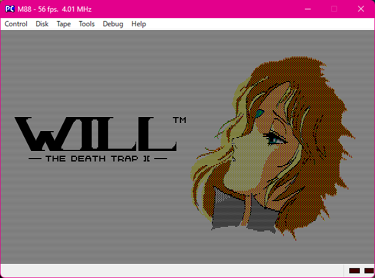

# M88 - PC8801 Series Emulator

  

  
  

## 初めに

cisc氏作のPC-8801エミュレータ[M88](http://retropc.net/cisc/m88/)をrururutan氏が改造した私家版をVisual Studio 2022でビルドできるようにしたものです。

  

## 動作環境

* Windows 11 しか見ていません

## 変更点

* ADPCMの音がおかしくなることがある問題を修正しています

## ライセンス

c86ctl.hは2条項BSDライセンスです。

新規ファイル/追加コードは2条項BSDライセンスになります。

既存のファイルは以下のオリジナルライセンスに従います。

* M88 はcisc氏が著作権を所有しています。
* M88 とそのソースコードは一切無保証です。
* M88 そのもの、または M88 の使用や、M88 を使用できなかったことなど、M88 に関して生じた損害はすべて使用者が自ら負うものとします。作者は一切責任を負いません。また、作者は M88 に関してバグ、不具合等があったとしてもそれに対処する義務を負いません。
* M88 の転載、及び配布は禁止します。但し，M88 のソースコードに改変を加えたもの，及び M88 のソースコードを利用したソフトに関しては，その限りではありません。
* M88.exe の使用者は NEC PC-8801 シリーズの本体を所有しなければなりません。また、使用する ROM データはその本体から直接取り出した ROM データでなければなりません。使用者の所有物でない本体から取り出した ROM データは使用できません。

* M88 のソースコードの一部，または全部を組み込んだソフトは，フリーソフトとして公開することが出来ます。
* 但し，src\pc88 のディレクトリの下にあるファイルを組み込む場合，または商用ソフト(シェアウェア含む)へのプラグインソフトとして配布する場合は，同時にそのソフトのソースコードもフリーソフトとして公開ください。
* 公開の際には，ドキュメント等に M88 のソースコードの一部または全部を組み込んだ事と，著作権表示を明示してください．また，作者への連絡を頂ければ幸いです。
* M88 のソースコードを利用したソフトのソースを配布する際には，M88 のソースコードのうち，そのソフトのコンパイルに必要なものに限り，添付することを認めます。
* 商用ソフト(シェアウェア含む) に M88 のソースコードの一部，または全部を組み込む際には，事前に M88 の作者の合意を得る必要があります。
* M88 に改変を加えたソフトを配布する場合は，M88 の著作権表示，および改変内容を明示してください。

